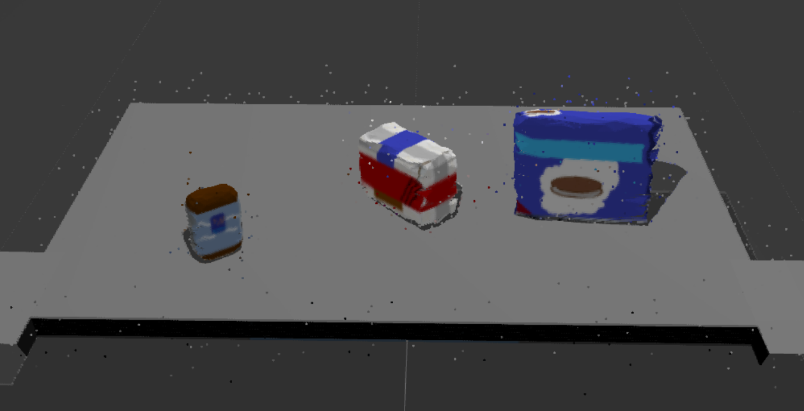
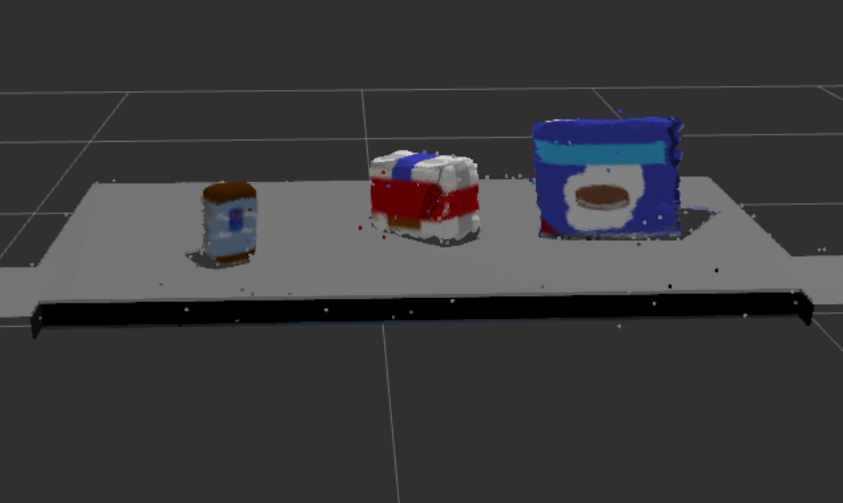

# RoboND_3D_Perception
*In this project, A PR2 robot outfitted with an RGB-D camera is given a cluttered tabletop scenario where a perception pipeline using Filtering, Segmentation, Clustering and Object Recognition is used to identify target objects from a so-called “Pick-List” in a particular order, pick up those objects and place them in corresponding dropboxes.*

**Gazebo, RViz, Moveit!** are used for simulating the environment in this project and **Python with ROS** is choosed for implementing this project.

This is a `README` that includes all the key points and how I addressed each one.

**Steps to complete the project:**  

1. Make sure you have already setup your ROS Workspace in the VM provided by Udacity or on your own local Linux/ROS install.
2. Complete Perception Exercises 1, 2 and 3, which comprise the project perception pipeline.
3. Download or clone the project [repository](https://github.com/udacity/RoboND-Perception-Project).

# 1. Exercise 1, 2 and 3 pipeline implemented 
## 1.1 Complete Exercise 1 steps. Pipeline for filtering and RANSAC plane fitting implemented.
In this project, totoally 3 fitlers are used for filtering:
1. Statistical Outlier Filtering:

    The given initial cloud point is filled with noise as shown below:
    
    
    
    After Statistical Outlier Filtering(some parameters needed to be tweaked around for accommodating this new environment), much of the 
    noise can be eliminated as below:
    
    

2. Voxel Grid Downsampling:

    RGB-D cameras provide feature rich and particularly dense point clouds, meaning, more points are packed in per unit volume than, for
    example, a Lidar point cloud. Running computation on a full resolution point cloud can be slow and may not yield any improvement on
    results obtained using a more sparsely sampled point cloud. So, Voxel Grid Downsampling is used to downsample the data by adjust the 
    voxel size.

3. PassThrough Filter:

    By using the  prior information about the location of our target in the scene, we can apply a Pass Through Filter to remove useless     data from your point cloud. By applying a Pass Through filter along z axis (the height with respect to the ground) to our tabletop   
    scene, we can retain only the tabletop and the objects sitting on the table as below:
    ![After_Pass_Through.PNG][image/After_Pass_Through.PNG]
    
