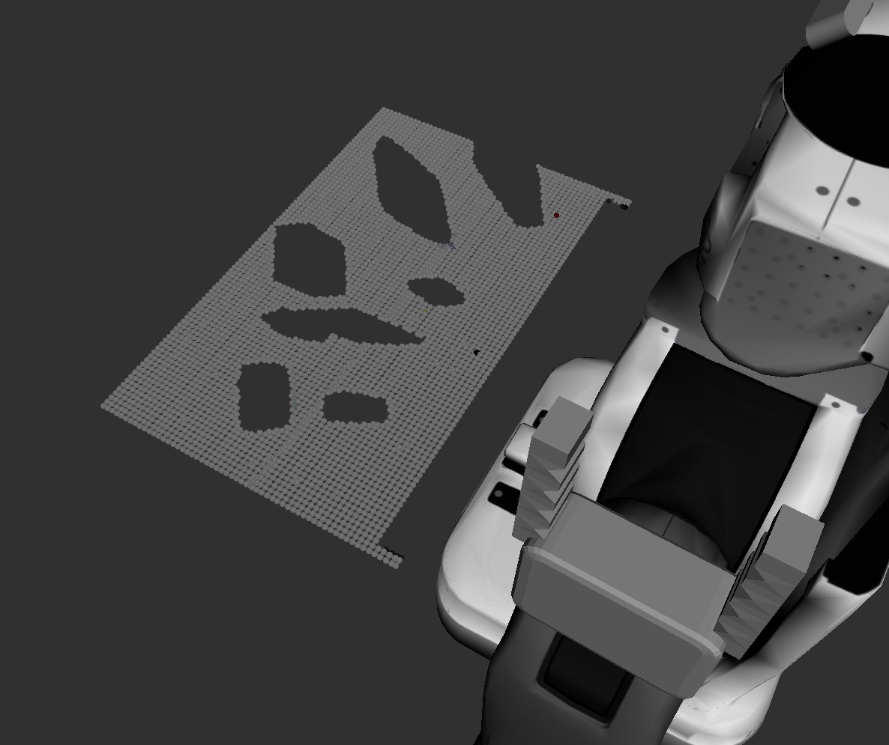
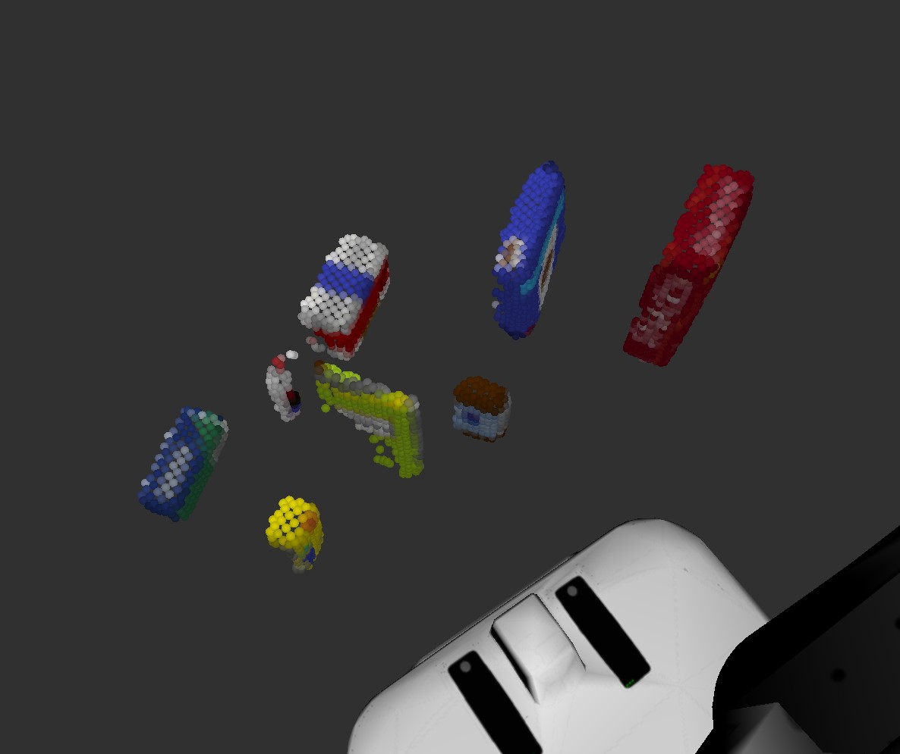
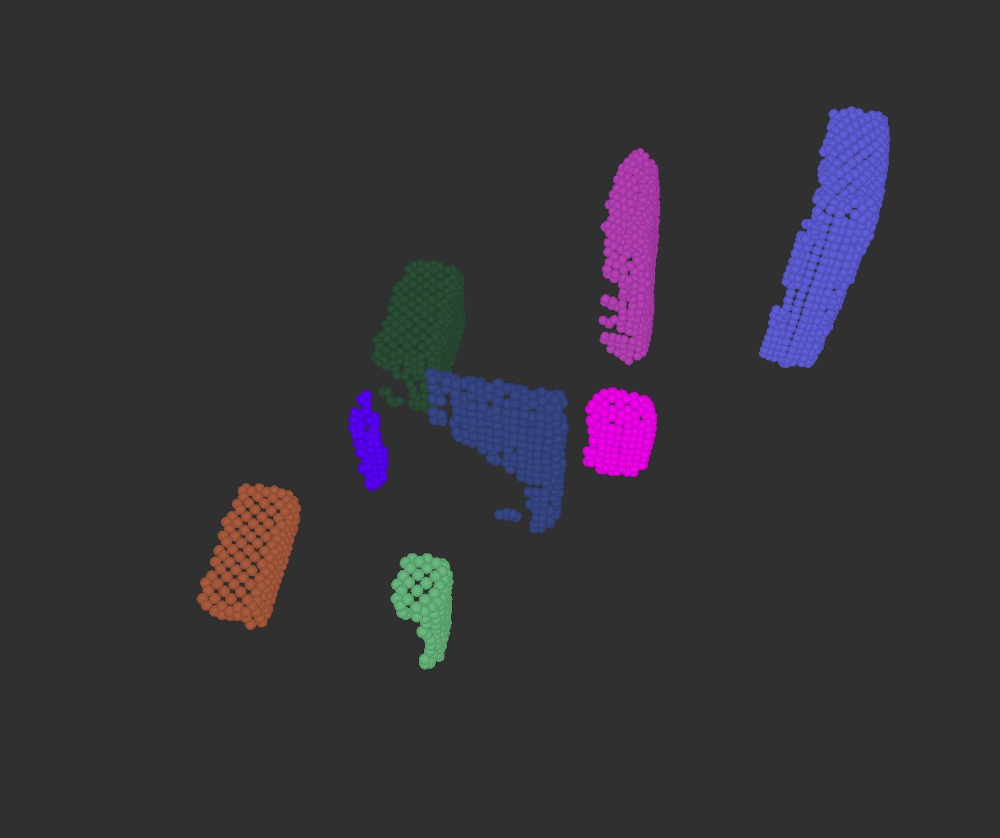
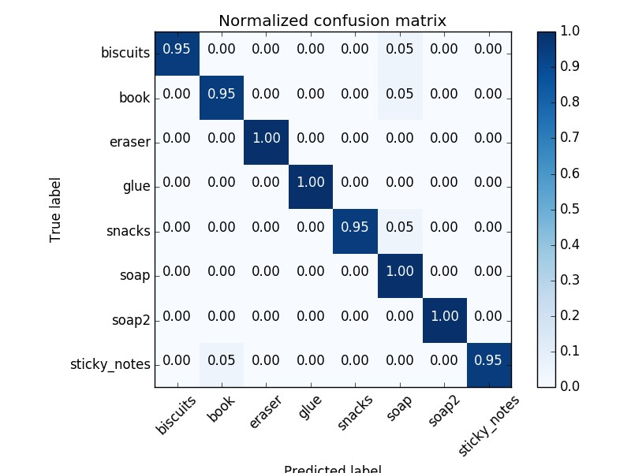
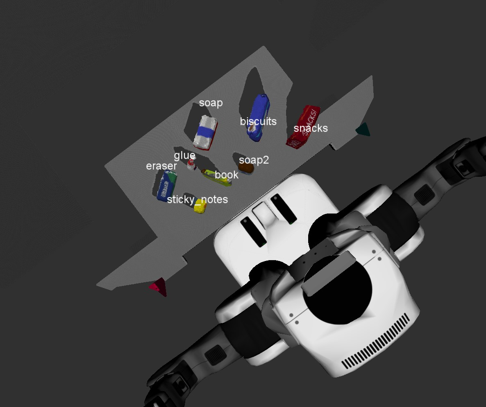
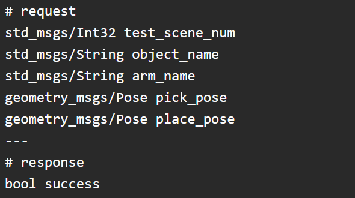
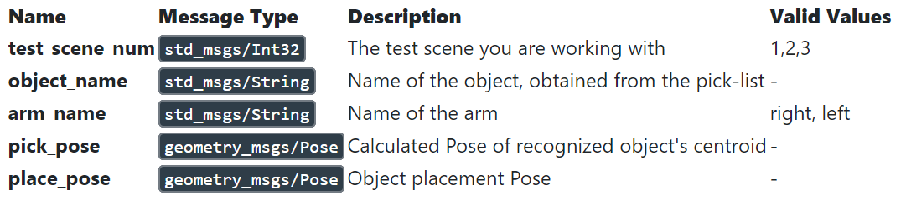

# RoboND_3D_Perception
*In this project, A PR2 robot outfitted with an RGB-D camera is given a cluttered tabletop scenario where a perception pipeline using Filtering, Segmentation, Clustering and Object Recognition is used to identify target objects from a so-called “Pick-List” in a particular order, pick up those objects and place them in corresponding dropboxes.*

**Gazebo, RViz, Moveit!** are used for simulating the environment in this project and **Python with ROS** is choosed for implementing this project.

This is a `README` that includes all the key points and how I addressed each one.

**Steps to complete the project:**  

1. Make sure you have already setup your ROS Workspace in the VM provided by Udacity or on your own local Linux/ROS install.
2. Complete Perception Exercises 1, 2 and 3, which comprise the project perception pipeline.
3. Download or clone the project [repository](https://github.com/udacity/RoboND-Perception-Project).

# 1. Exercise 1, 2 and 3 pipeline implemented 
## 1.1 Complete Exercise 1 steps. Pipeline for filtering and RANSAC plane fitting implemented.
In this project, totoally 3 fitlers are used for filtering:
1. Statistical Outlier Filtering:

    The given initial cloud point is filled with noise as shown below:
    
    
    
    After Statistical Outlier Filtering(some parameters needed to be tweaked around for accommodating this new environment), much of the 
    noise can be eliminated as below:
    
    

2. Voxel Grid Downsampling:

    RGB-D cameras provide feature rich and particularly dense point clouds, meaning, more points are packed in per unit volume than, for
    example, a Lidar point cloud. Running computation on a full resolution point cloud can be slow and may not yield any improvement on
    results obtained using a more sparsely sampled point cloud. So, Voxel Grid Downsampling is used to downsample the data by adjust the 
    voxel size.

3. PassThrough Filter:

    By using the  prior information about the location of our target in the scene, we can apply a Pass Through Filter to remove useless     data from your point cloud. By applying a Pass Through filter along z axis (the height with respect to the ground) to our tabletop 
    scene, we can retain only the tabletop and the objects sitting on the table.

As for the RANSAC plane fitting - segmentation, the *make_segmenter()* function inside **Python PCL** library is implemented. After setting the model by *set_model_type()* and *set_method_type* and defining the *max_distance*(Max distance for a point to be considered fitting the model), the **inlier** is extracted as the table:

And the **outlier** is extracted as the objects:

## 1.2 Complete Exercise 2 steps: Pipeline including clustering for segmentation implemented.
Compared to k-means clustering where the number of clusters is set to be k, the DBSCAN(Density-Based Spatial Clustering of Applications with Noise) clustering, also be called Euclidean Clustering is implemented in this project. The according result is shown below, each different clusters are indicated by different colors. For more details about how it is implemented, please refer to `project_template.py` line 161-169.

## 1.3 Complete Exercise 3 Steps. Features extracted and SVM trained. Object recognition implemented.
Features are extracted using *compute_color_histograms()* and *compute_normal_histograms()* functions inside `feature.py`. Also, SVM has been trained and the output: normalized confusion matrix is shown below:

Then object recognition steps are implemented in the *pcl_callback()* function within `project_template.py`. Each cluster goes through the feature extraction and those features are passed into the trained classifier for objects' type prediction.

The Finial perception result is shown below:

# 2. Pick and Place Setup
## 2.1 For all three tabletop setups (`test\*.world`), perform object recognition, then read in respective pick list (`pick_list_\*.yaml`). Next construct the messages that would comprise a valid PickPlace request output them to .yaml format.
The pick and place operation is implemented as a request-response system(service in ROS) as shown below:

The requests' details are:

The detailed process of how to get these requests' value can be found in *pcl_callback()* function within `project_template.py`.

After getting all the messages we need and we're ready to create a `.yaml` output file by using the helper function *make_yaml_dict()*. The the according output files are `output_1.yaml`, `output_2.yaml` and `output_3.yaml` according to test_world_1, test_world_2 and test_world_3.

# Additional Challenges: Considering collision mapping and using the pick_place_server to execute the pick and place operation!
